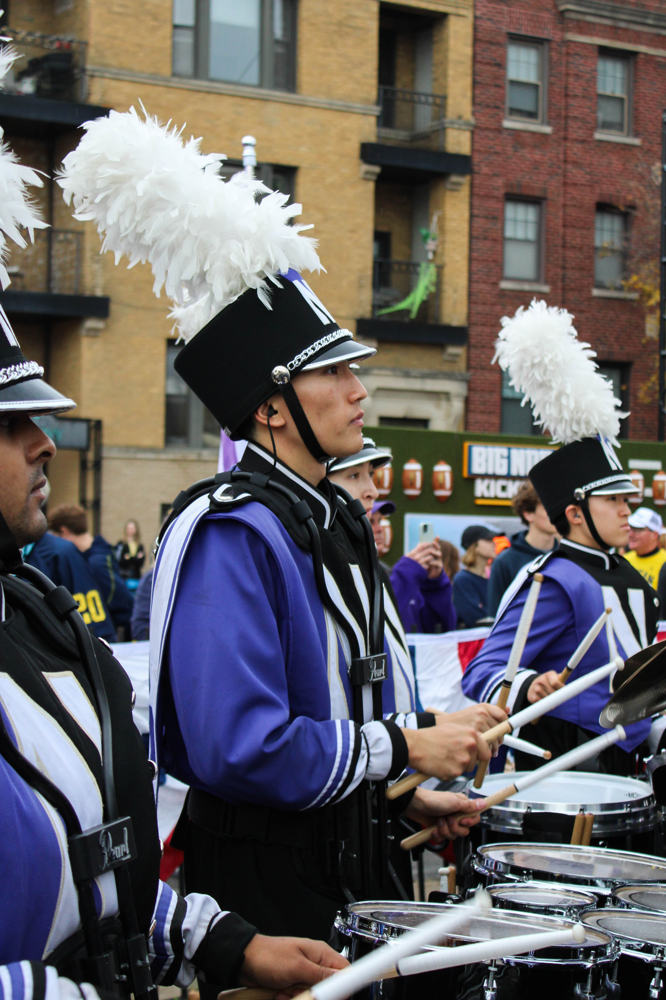
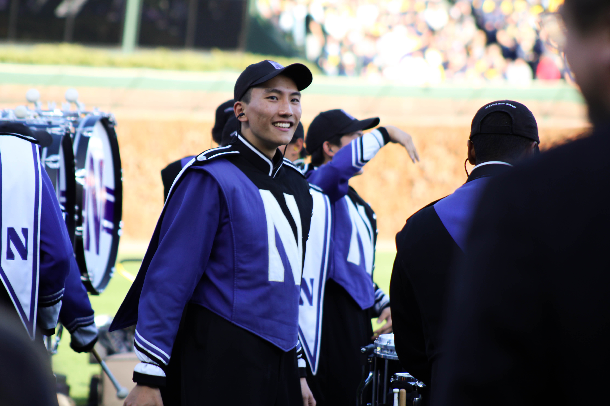
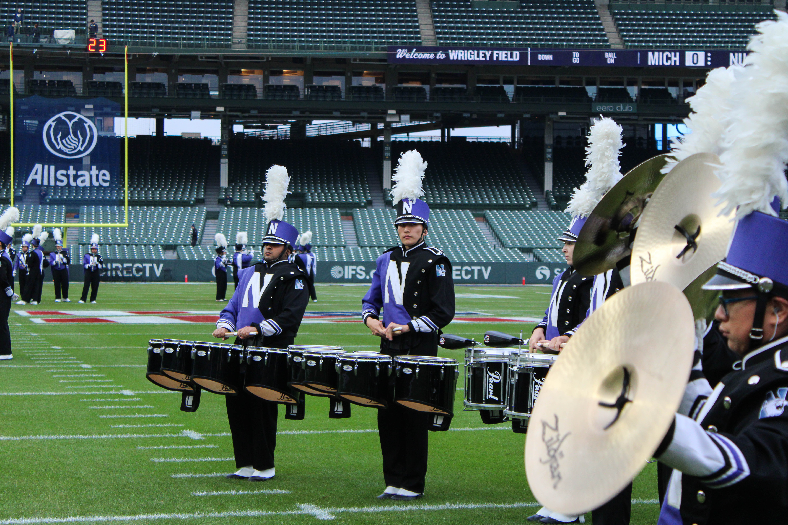
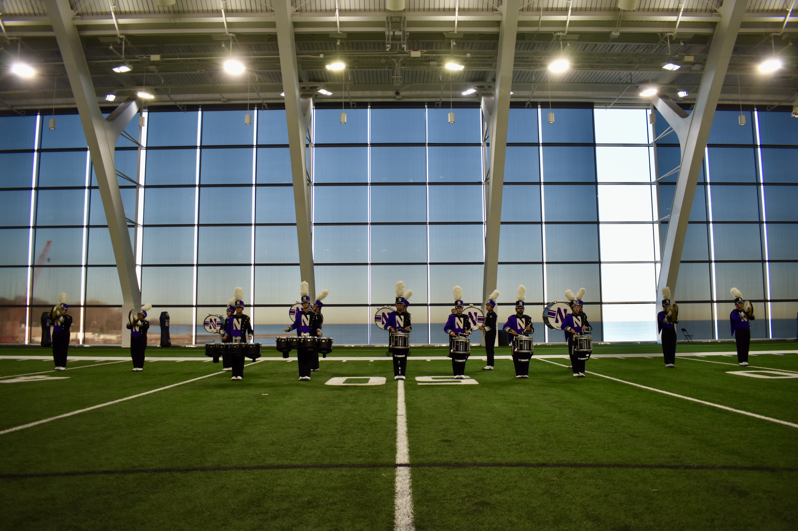

::: {style="margin-bottom: -10px;"}
## Hello!
:::

I am a senior at Northwestern University, majoring in [Data Science](https://statistics.northwestern.edu/), [Mathematics](https://www.math.northwestern.edu/), and the [Integrated Science Program](https://isp.northwestern.edu/) (ISP). I work in the [Center for Network Dynamics](https://cnd.northwestern.edu/) as an undergraduate researcher, advised by [Prof. Adilson Motter](https://physics.northwestern.edu/people/faculty/core-faculty/adilson-motter.html), and I was named a [2026 Goldwater Scholar](https://goldwaterscholarship.gov/).

My academic interests lie at the intersection of machine learning and high-dimensional statistics, with an emphasis on analyzing complex scientific data. My current work focuses on developing a mathematical framework to model gene expression epistasis in *E. coli* (see [Research](research/index.qmd)). As a passionate sports fan, I also apply similar quantitative tools to explore topics in sports analytics that spark my curiosity (see [Projects](projects/index.qmd)).

**I am currently pursuing PhD opportunities in Statistics and Applied Mathematics for Fall 2027.**

Outside of academics, I enjoy playing music in various campus and community ensembles as a percussionist. Most notably, I have been a part of the [Northwestern University "Wildcat" Marching Band](https://northwesternbands.org/numb) (NUMB) for all four years in college, including as a [drumline](https://www.nudrumline.org/) captain for the past two seasons. Below are some highlights from my time in NUMB!

:::: {.columns}

::: {.column style="padding-right: 10px;"}
{group="numb" height=420px .lightbox}
:::

::: {.column style="padding-left: 10px;"}
{group="numb" style="margin-bottom: 10px;" height=130px .lightbox}
{group="numb" style="margin-top: 5px; margin-bottom: 5px;" height=130px .lightbox}
{group="numb" style="margin-top: 10px;" height=130px .lightbox}
:::

::::
