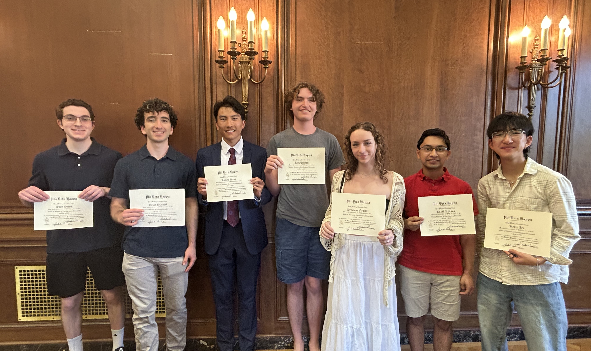
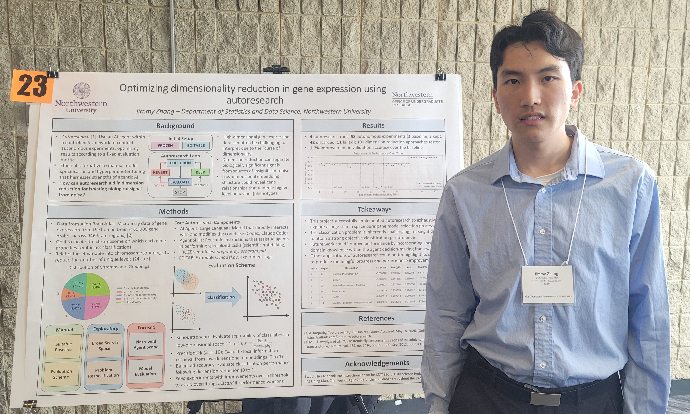
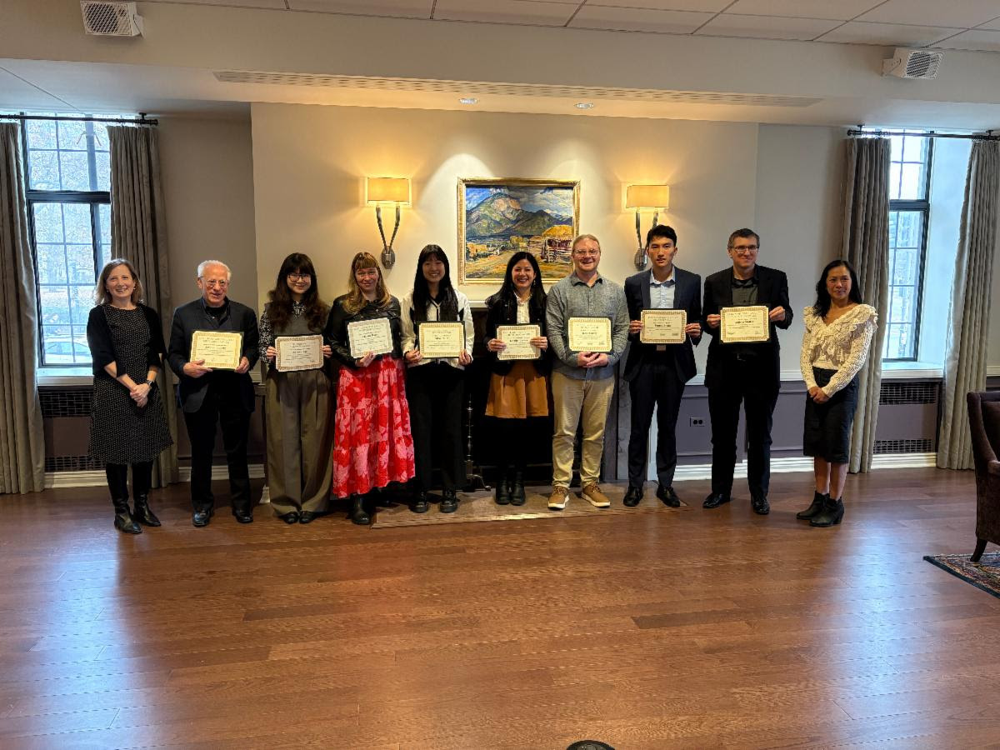
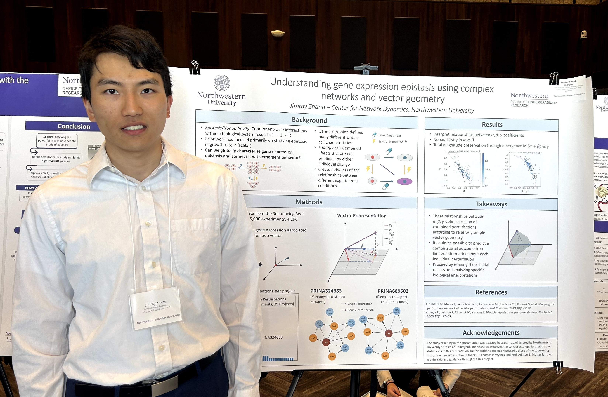

**\[2026/06\]:** I was 1 of 25 juniors from the Weinberg College of Arts and Sciences elected to [Phi Beta Kappa](https://www.pbk.org/) (Alpha of Illinois chapter), the oldest academic honor society in the United States.  

  
Mathematics Majors Inducted into Phi Beta Kappa

  {width=600px fig-align="left"}

**\[2026/05\]:** I presented a poster *(Optimizing dimensionality reduction in gene expression using autoresearch)* at the 2026 Northwestern Undergraduate Research Expo.  

  
2026 Research Expo

  {width=600px fig-align="left"}

**\[2026/03\]:** I received a [Goldwater Scholarship](https://goldwaterscholarship.gov/), the premier national undergraduate award recognizing talented college sophomores and juniors with exceptional STEM research potential.  
[Press Release](https://news.northwestern.edu/stories/2026/4/two-northwestern-students-named-goldwater-scholars)

**\[2025/09\]:** I was awarded the Fletcher URG Prize for the most outstanding 2025 summer project in Natural Sciences and Engineering.  

  
2025 Fletcher Ceremony

  {width=600px fig-align="left"}

**\[2025/05\]:** I presented a poster *(Understanding gene expression epistasis using complex networks and vector geometry)* at the 2025 Northwestern Undergraduate Research Expo.  

  
2025 Research Expo

  {width=600px fig-align="left"}

**\[2025/05\]:** I presented a lightning talk *(The geometry of gene expression epistasis)* at the [National Institute for Theory and Mathematics in Biology](https://www.nitmb.org/) (NITMB).

**\[2025/04\]:** I was awarded a [SURG Advanced](https://undergradresearch.northwestern.edu/funding/surg/summer-urg-advanced/) to support my project: *Understanding the biological interactions of gene expression epistasis.*

**\[2024/09\]:** I was named 1 of 10 finalists for the 2024 Fletcher URG Prize in Natural Sciences and Engineering.

**\[2024/04\]:** I was awarded a [Summer Undergraduate Research Grant](https://undergradresearch.northwestern.edu/funding/surg/) (SURG) to support my project: *Modeling gene expression epistasis in a complex network to understand emergent behaviors.*

